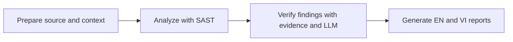

# Plan to remove unsupported VulnHunterX fuzzing implementation

Fuzzing is unsupported. Current product documentation, example configuration, and training materials describe only `prepare → analyze → verify → report`. Recommend removing the residual implementation in one focused breaking-change release. The current `scan` command already composes those four stages, so code cleanup primarily affects legacy CLI commands, configuration types, the fuzz package, and example scripts.

This maintainer plan is based on the local checkout reviewed on 4 October 2026. The documentation cleanup is complete; the remaining steps propose runtime code removal. Legacy symbols below are a deletion inventory, not usage instructions. External callers and their compatibility needs have not been inventoried.

## Desired behavior and scope

The resulting product performs static analysis, evidence-based LLM triage, and report generation for all eight currently supported languages. It retains CodeQL database preparation, source-only Semgrep/OpenGrep scanning, CodeQL/tree-sitter/snippet context, guided questions, typed evidence, deterministic policies, provider routing, and EN/VI reports.

Remove stages 5–8 and their harness-generation, compilation repair, execution, corpus, and crash-triage behavior. Existing TP/FP/NMD verdicts remain static/LLM judgments and must not be presented as runtime exploit confirmation. NMD remains an abstention when evidence is inadequate; removal adds no substitute confirmation mechanism.



## Findings and dependencies

| Area | Observed dependency | Proposed action |
| --- | --- | --- |
| [cli/main.py](../src/vuln_hunter_x/cli/main.py) | Imports, parser registrations, argument helpers, and dispatch for four fuzz commands | Remove all four layers for those commands |
| [cli/commands.py](../src/vuln_hunter_x/cli/commands.py) | `cmd_build_sanitized`, `cmd_extract_fuzz_context`, `cmd_generate_fuzz_drivers`, and `cmd_fuzz_run`; fuzz imports are local to handlers | Delete these handlers; keep `cmd_scan` and shared stage functions |
| [fuzz package](../src/vuln_hunter_x/fuzz/__init__.py) | 11 Python files, 3,810 lines in this checkout, including package exports | Delete the package after detaching its consumers |
| [core/config.py](../src/vuln_hunter_x/core/config.py) | `FuzzConfig`, `Config.fuzz`, YAML construction, argument merging, environment override, and three `RepoPaths` fields | Remove the feature's configuration and path fields throughout |
| [core/constants.py](../src/vuln_hunter_x/core/constants.py) | Fuzz defaults and build-log limits; an LLM timeout is shared | Remove unused fuzz constants; retain shared timeout |
| [confirm_findings.yaml](../config/confirm_findings.yaml) | The unsupported settings and output-directory descriptions have been removed | Complete; keep them out of the supported configuration example |
| [C++ context queries](../config/queries/tools/cpp/qlpack.yml) | Stage 6 runs only `function_signatures.ql` and `includes.ql` | Delete these two feature-specific queries after checking remaining consumers |
| [examples](../examples/README.md) | Four scripts have optional fuzz functions, flags, statistics, and output references | Retain scripts and stages 1–4; remove their optional fuzz paths |
| Tests | Five dedicated fuzz/crash test modules plus one fuzz-specific test in a shared helper module | Remove dedicated tests and only the obsolete shared test; add removal regressions |
| Packaging and documentation | Current product claims, issue option, workshops, and decks now describe the supported pipeline | Documentation cleanup complete; preserve historical results and add API migration guidance with code removal |

The legacy implementation and CLI are centered on C/C++ libFuzzer. Historical changelog text also mentions Atheris/Jazzer/php-fuzzer, but this reviewed package does not contain corresponding generators or runners. Do not assume separate implementations exist.

## Shared functionality to preserve

- Keep `llm/completion.py:run_completion()`, `codeql/repository.py` build assistance, and `reporting/markdown.py` translation. Keep `TIMEOUT_LLM_REQUEST`; revise its fuzz-related comment and the completion helper docstring.
- Keep `codeql/context_extractor.py`, its `ContextExtractorDB`, database discovery, query execution, and `QUERIES_BY_LANG`. Stage 6 imports this shared module; the dependency direction does not make it a fuzz feature.
- Keep ordinary `functions`, `callers`, `structs`, `globals`, `macros`, `free_sites`, `destructors`, and `field_writes` queries and CSVs. Keep `enums.ql` and `typedefs.ql`: `context/provider.py` and `context/evidence.py` also consume enum/typedef evidence, with tests for those CSVs. They are not currently in the ordinary C/C++ extraction list; any change to that coverage is a separate task.
- Keep framework sanitizer/guard evidence, source-to-sink validation, prompt vocabulary, and security rules. Input sanitizers are distinct from the removed ASan/UBSan build stage.
- Keep `_is_nonproduction_path()` and related prompt/tests that recognize test, benchmark, and fuzz harnesses in target repositories. Keep benchmark references to files such as `imgRead_libfuzzer.c` and targets such as fuzzgoat.
- Keep normal target build commands and compiler support required by CodeQL preparation. Removing fuzzing does not make all compiled-language builds unnecessary.
- Keep provider libraries, tree-sitter language bindings, YAML support, and the benchmark extras. `pyproject.toml` declares no dedicated fuzz dependency or fuzz extra to remove.

## Recommended compatibility policy

Treat deletion of the four commands, `vuln_hunter_x.fuzz` imports, `FuzzConfig`, `Config.fuzz`, and the three `RepoPaths` fields as breaking changes. Document them in the next release's migration notes. The recommended end state has no fuzz implementation or compatibility stubs.

For operator configuration, preserve loading of an old YAML containing `fuzz:` for one transition release: ignore that section and emit a clear warning without printing its values. Remove the `MAX_FIX_ITERATIONS` override and document that it no longer controls anything; if warning on its presence during the transition, never log its value. Then remove the special compatibility warning in a later release according to the announced policy. Current `Config.from_dict()` already ignores unrelated keys, so strict validation of every unknown setting would be a separate behavior change.

Removed commands should exit nonzero with argparse's invalid-command error and list the remaining commands. Do not silently turn `fuzz-run` into `scan`. Examples that manually inspect `sys.argv` must explicitly reject obsolete `--fuzz`, `--fuzz-timeout`, and `--fuzz-max-time` options instead of silently ignoring them.

If external consumers require a prior deprecation release, stage warnings in that release before deleting the API. This is an alternative rollout choice, not a requirement to maintain fuzzing indefinitely.

## Implementation sequence

### 1 Establish a baseline

Record focused tests and the main suite on the pre-removal revision in the selected development environment. Use mocked providers and subprocesses to capture parser choices, stage composition, local-path wiring, config merging, source-only fallback, saved verdict loading, and report generation. Record existing failures separately.

Inventory callers of the removed imports and configuration fields. Confirm source and test references with `rg`; source counts above are a snapshot rather than a maintenance target.

### 2 Detach interfaces and remove the package

Remove `cmd_*` imports, four parser registrations, `_add_build_sanitized_args`, `_add_extract_fuzz_context_args`, `_add_generate_fuzz_drivers_args`, `_add_fuzz_run_args`, and dispatch branches from `cli/main.py`. Remove the matching four handlers from `cli/commands.py`, then delete all 11 modules under `src/vuln_hunter_x/fuzz/`.

Remove `FuzzConfig`, the `Config.fuzz` field, parsing/construction, the `replace(self.fuzz, ...)` branch of `merge_with_args()`, and the environment override. Remove `RepoPaths.sanitized_build`, `.fuzz_targets`, and `.fuzz_results` plus their factory assignments. Retain the ordinary output paths.

Remove `DEFAULT_MAX_FIX_ITERATIONS`, `TIMEOUT_SANITIZED_BUILD`, `BUILD_LOG_LLM_PREVIEW_CHARS`, and `BUILD_LOG_MAX_ERROR_CHARS` after a final consumer search. Preserve shared LLM constants. Update the default YAML and add the proposed legacy-configuration warning with regression coverage.

### 3 Remove query and example paths

Delete `config/queries/tools/cpp/function_signatures.ql` and `includes.ql` after confirming no remaining references. Keep the query pack and all shared queries described above.

Update `examples/pipeline_c.py`, `pipeline_cpp.py`, `pipeline_zlib.py`, and `run_all_pipelines.py`: remove fuzz stage functions, flags, invocation blocks, timeout handling, result/statistics keys, and output hints. Preserve existing target definitions and static pipelines. Review `examples/README.md` against the scripts; it already contains stale stage and target descriptions.

### 4 Update tests and documentation

Remove `tests/test_fuzz_context_enriched.py`, `test_fuzz_driver_generator.py`, `test_fuzz_improvements.py`, `test_fuzz_symbol_analysis.py`, and `test_crash_triage.py`. In `tests/test_llm_completion_helper.py`, remove only `test_fuzz_repair_passes_temperature_and_retry`; retain kwargs, retry, and provider-compatibility tests.

Add focused tests for remaining CLI commands and aliases, rejection of removed commands/options, current and legacy configuration behavior, config merging, and expected repository paths. Keep end-to-end stage composition mocked. Preserve existing tests for target-project fuzz filenames and enum/typedef/sanitizer evidence.

Documentation cleanup completed: README title/features, pipeline tables, CLI reference, quick-start flags, project tree, output descriptions, `pyproject.toml`'s description, and `.github/ISSUE_TEMPLATE/bug-report.yml` now reflect the supported pipeline. Add a changelog entry with the removed API and migration policy when code removal lands rather than rewriting historical release entries. Refresh agent documents when the removal is implemented.

Workshop and training documentation and deck sources now describe only the supported pipeline. Preserve general explanations of sanitizers and runtime testing and references to target-project harnesses; those remain relevant to static analysis.

Slide decks and existing presentation previews are regenerated as part of the documentation cleanup. Keep future distributed assets synchronized with their generator sources and visually inspect changed slides.

### 5 Validate and release

Run affected regressions, then the configured Python checks and both test roots:

```bash
python -m ruff check src/
python -m ruff format --check src/
python -m mypy src/
python -m pytest tests/
python -m pytest benchmark/tests/
python -m vuln_hunter_x.cli.main --help
```

Run representative example dry-runs after reviewing each script's dry-run behavior. Use synthetic targets and mocked stage commands to avoid downloads, builds, and paid provider calls for the core regression gate. Validate removed-option rejection separately.

Build a wheel and sdist in the chosen packaging environment, inspect their contents for the absent fuzz package, and smoke-test the remaining CLI in a clean install. Verify packaged import failure for `vuln_hunter_x.fuzz`; an editable environment can hide stale installed files. Packaging tooling may need installation beyond the declared `dev` extra. Do not use the release script as a harmless check: it deletes `dist/` before rebuilding.

Search source, config, tests, examples, and current docs for feature references. Review remaining matches by meaning; a blanket requirement that the word `fuzz` or `sanitizer` disappear would damage verification and historical evidence. Compare mocked verdict/report outputs with the baseline; a real precision/recall comparison is optional additional evidence and requires consistent targets and provider settings.

## Acceptance criteria

- Core CLI commands, aliases, `scan`, and `interactive` work; the four fuzz commands are absent and fail explicitly when invoked.
- No runtime code imports the removed package or accesses removed configuration/path fields. Wheel and sdist contain no fuzz package.
- Current configuration loads, legacy settings follow the announced migration policy, and ordinary config merging and paths still work.
- All eight language choices, source-only scanner fallback, local-path mode, shared context queries, enum/typedef evidence, and sanitizer/guard evidence remain supported.
- Verification identity, anchors, TP/FP/NMD semantics, saved verdicts, and EN/VI reports pass relevant regressions.
- Examples retain stages 1–4 and reject obsolete fuzz options; current docs and distributed decks match delivered behavior.
- Relevant tests, both test roots, and tooling results are recorded honestly, including pre-existing failures or missing tools.
- Existing `output/`, `repos/`, benchmark baselines, and historical changelog records remain intact.

## Risks and rollback

The largest risks are breaking external Python consumers, leaving stale parser/config references, deleting shared evidence queries, or weakening verification because a text search matched target-project fuzzing. The dependency inventory, migration policy, clean-install checks, and preserved regressions address those risks.

Package deletion should reduce code maintenance and remove optional harness execution, but this review does not measure speed or quality gains. Ordinary scans already skip fuzzing, so do not promise faster stages 1–4. Runtime confirmation is lost; static/LLM triage remains useful but is not a substitute for an executed reproducer.

Rollback by reverting the focused removal change or pinning the prior release. Do not delete artifacts during removal: stored crashes and corpora can still be inspected with the previous version. Any artifact cleanup should be a separately requested operation with an explicit scope.
