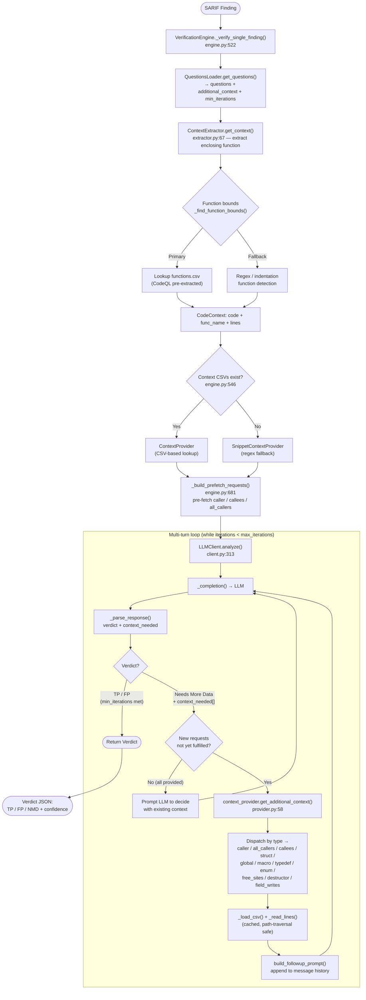
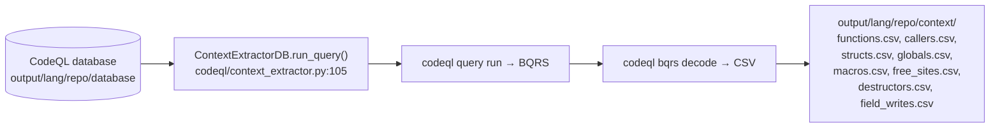

# Context Extraction in the Verification Process

This document describes how source-code context is extracted and supplied to the
LLM during the verification stage of the VulnHunterX pipeline.

## Context Extraction Flow

## How CodeQL CSVs are pre-generated (Stage 2, upstream)

## Key points

- **Two-phase context model.** Some context is **pre-fetched** upfront (anything
  keyed off the function name: `caller`, `callees`, `all_callers` —
  `engine.py:681`). The rest is **reactive** — fetched only when the LLM asks for
  it via `context_needed` in a `Needs More Data` verdict.

- **Two providers.** `ContextProvider` does CSV lookups against CodeQL-extracted
  files; if those CSVs don't exist, the engine falls back to
  `SnippetContextProvider`, which regex-scans the snippet and returns an
  `<unavailable: out-of-snippet>` sentinel when data is outside scope.

- **The multi-turn loop** (`client.py:313`) deduplicates requests against
  already-fulfilled context, gates early TP/FP verdicts behind `min_iterations`,
  and can `_force_decision_turn()` if the LLM stalls on `Needs More Data`.

- **11 context types** are supported, with the C/C++-specific ones (`free_sites`,
  `destructor`, `field_writes`) targeting use-after-free / TOCTOU analysis.

## Reference: components and entry points

| Component | File | Methods |
|---|---|---|
| Heuristic context | `context/extractor.py` | `get_context()` (67), `_find_function_bounds()` (173) |
| CodeQL extraction | `codeql/context_extractor.py` | `run_query()` (105), `extract_for_database()` (180) |
| CSV provider | `context/provider.py` | `get_additional_context()` (58), `_load_csv()` (119) |
| Snippet fallback | `context/snippet_provider.py` | `get_additional_context()` (53) |
| Engine | `verification/engine.py` | `_verify_single_finding()` (522), `_build_prefetch_requests()` (681) |
| Questions | `questions/loader.py` | `get_questions()` (165) |
| LLM client | `llm/client.py` | `analyze()` (313), `_parse_response()` (1189) |
| Prompts | `llm/prompts.py` | `build_user_prompt()` (193), `build_followup_prompt()` (315) |
