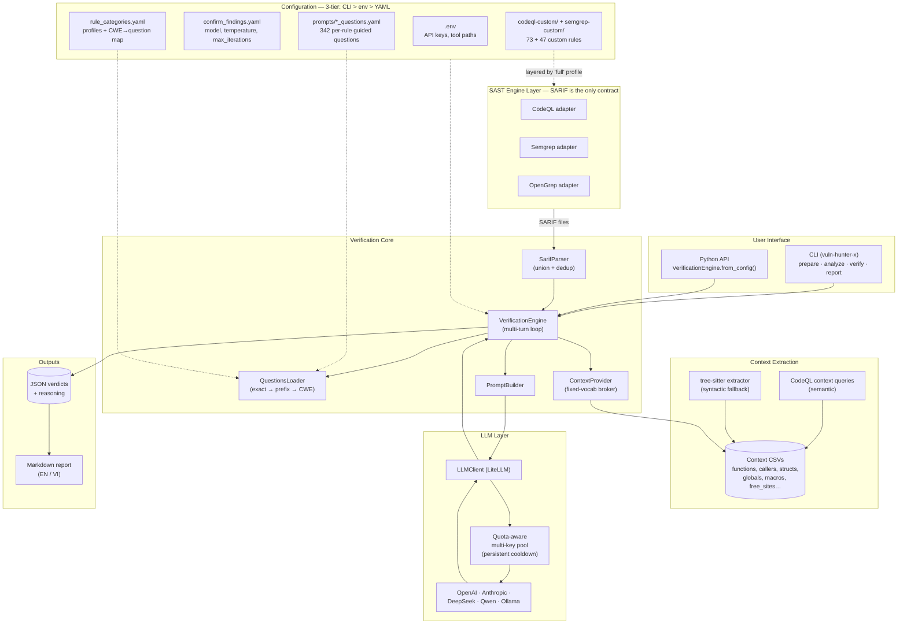
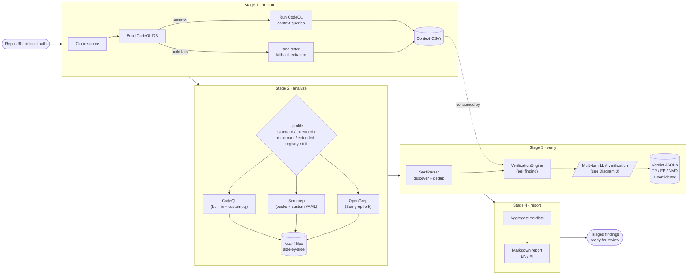
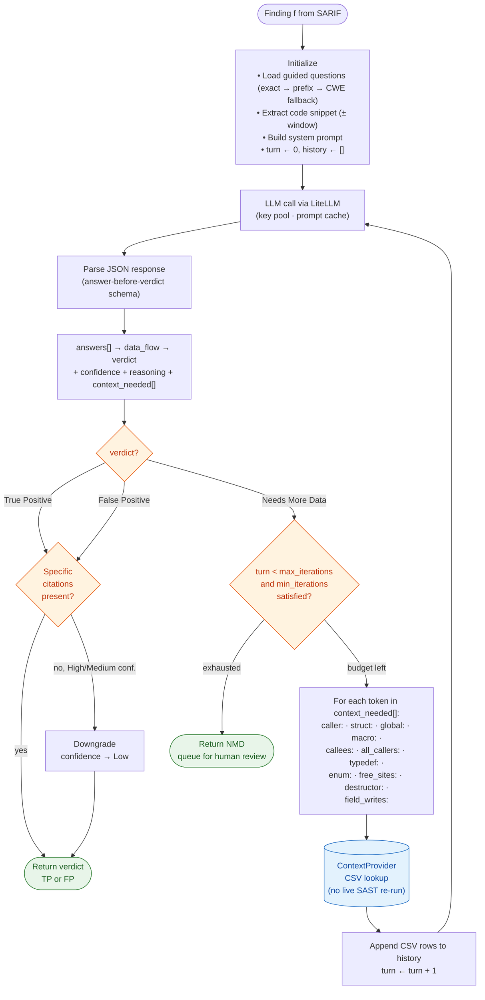
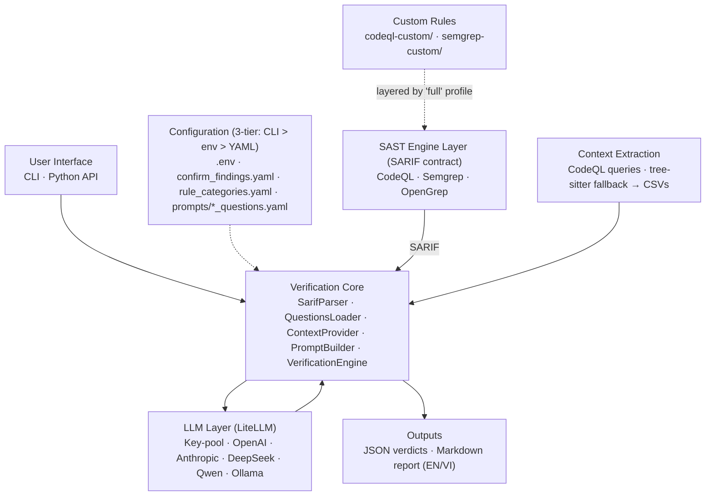
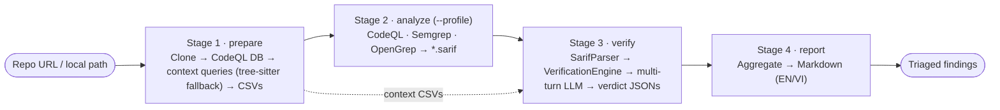
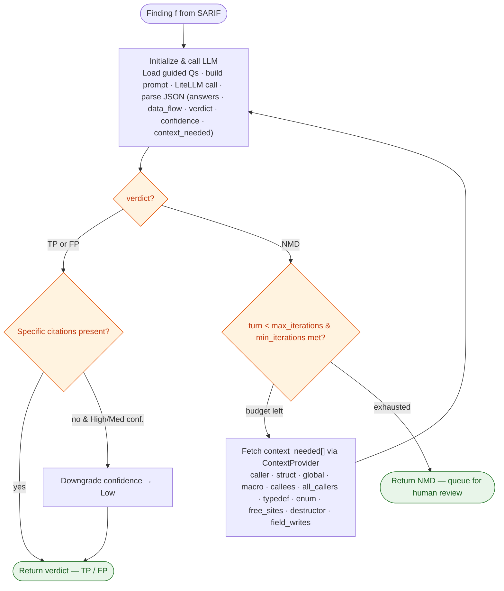

# VulnHunterX — Flow Charts

Mermaid sources.

**Preview tips**
- VS Code: install the extension **"Markdown Preview Mermaid Support"** (bierner.markdown-mermaid). The built-in preview does not render Mermaid by itself.
- GitHub: renders automatically in `.md` files.
- Export to SVG/PNG: `npx -p @mermaid-js/mermaid-cli mmdc -i docs/paper/diagrams.md -o docs/paper/diagram.svg`
- Online editor (paste a single fenced block): https://mermaid.live
- Draw.io: the `*.drawio.svg` files (`architecture.drawio.svg` §1d, `llm-verification.drawio.svg`
  §3d) are *editable* SVGs — they render inline here but also open for editing in draw.io / the
  VS Code **"Draw.io Integration"** extension.

---

## 1. Framework Architecture

---

## 2. Full Pipeline Workflow (Stages 1–4, fuzzing excluded)

---

## 3. LLM Verification Process (per finding)

---

## Simplified Diagrams

Compact versions of the three diagrams above for use as paper figures.
Each subgraph from the detailed version is collapsed into a single node
whose label lists its members.

### 1s. Framework Architecture (simplified)

### 1d. Framework Architecture (draw.io)

A draw.io version of 1s — the same hub-and-spoke architecture (sources → **Verification Core** →
LLM / outputs, SARIF as the only contract). Like §3d, this is a standalone **editable SVG**: it
renders inline below *and* opens for editing in draw.io / the VS Code **"Draw.io Integration"**
extension (the editable model is embedded in the file's `content` attribute). The Mermaid sources
remain the source of truth for the paper figures.

### 2s. Pipeline Workflow (simplified)

### 3s. LLM Verification (simplified)

### 3d. LLM Verification (draw.io)

A draw.io version of 3s — same per-finding flow (verify the finding → decide the verdict → get
context), drawn in the classic draw.io style. Unlike the Mermaid blocks above, this is a standalone
**editable SVG**: it renders inline below *and* opens for editing in draw.io / the VS Code
**"Draw.io Integration"** extension (the editable model is embedded in the file's `content`
attribute). The Mermaid sources remain the source of truth for the paper figures.

