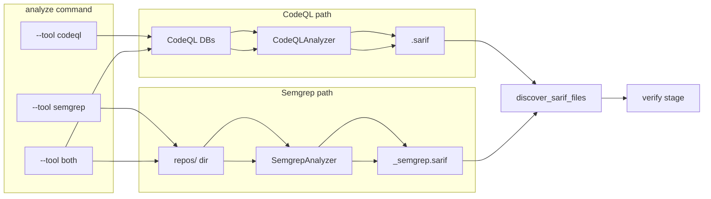

# Plan: Integrate Semgrep (run CodeQL and/or Semgrep, verify from SARIF)

**Overview:** Add Semgrep as a second analyzer that writes SARIF alongside CodeQL. Users can run CodeQL only, Semgrep only, or both via a `--tool` flag. Verify stage continues to read all SARIF files with no change to verification logic; discovery is extended so Semgrep SARIF files yield the correct repo name for context lookup.

---

## Current flow

- **Analyze:** [cmd_analyze](src/vuln_hunter_x/cli/main.py) discovers CodeQL DBs, runs [CodeQLAnalyzer.run_analysis](src/vuln_hunter_x/codeql/analysis.py), writes `output/sarif/<lang>/<repo>.sarif`.
- **Verify:** [discover_sarif_files](src/vuln_hunter_x/sarif/parser.py) finds `output/sarif/<lang>/*.sarif`, returns `(path, lang, repo_name)` with `repo_name = stem`; [parse_sarif_file](src/vuln_hunter_x/sarif/parser.py) and the verification engine consume findings. Context is resolved by `repo_name` (e.g. `repos/<lang>/<repo_name>/`).

## Design choices

- **One analyze command, one output dir:** Keep a single `analyze` command and single `output/sarif/<lang>/` tree. Add a `--tool` option: `codeql`, `semgrep`, or `both`.
- **Naming:** CodeQL keeps `output/sarif/<lang>/<repo>.sarif`. Semgrep writes `output/sarif/<lang>/<repo>_semgrep.sarif` so both can coexist.
- **Repo name for Semgrep SARIF:** For verify and context, `repo_name` must be the actual repo (e.g. `c-ares`), not `c-ares_semgrep`. Extend discovery so that when the stem ends with `_semgrep`, `repo_name = stem[:-8]`.
- **Verify:** No change to verification engine or to how it reads SARIF; only discovery and analyze behavior change.
- **Guided questions:** [QuestionsLoader.get_questions](src/vuln_hunter_x/questions/loader.py) already falls back to `_generate_generic_questions` for unknown rule IDs, so Semgrep rule IDs work without new mappings (optional: add Semgrep-specific entries to guided_questions.yaml later).

---

## 1. Semgrep analyzer module

**New:** `src/vuln_hunter_x/semgrep/` (or `src/vuln_hunter_x/semgrep/analyzer.py`).

- **SemgrepAnalyzer** (mirroring the CodeQL analyzer role):
  - `run_analysis(repo_path: Path, lang: str, repo_name: str, output_dir: Path, config: str | None = None) -> tuple[bool, Path | None, str]`.
  - Invoke CLI: `semgrep scan --sarif --sarif-output=<path> [--config=<config>] <repo_path>`.
  - Map internal `lang` to Semgrep `--lang` where needed (e.g. `c`/`cpp` → `c`/`cpp`; Semgrep uses `--config auto` for language detection or explicit `--lang`).
  - Write to `output_dir / "sarif" / lang / f"{repo_name}_semgrep.sarif"`.
  - Require `semgrep` on PATH or `SEMGREP_PATH` env; return a clear error if missing.
- **Config:** Optional `--config` for Semgrep (e.g. `auto`, `p/security-audit`, or path to YAML). Default `auto` if not specified.
- **Skip/force:** Same pattern as CodeQL: skip if SARIF exists unless `--force`; optional `--dry-run`.

Reference: Semgrep CLI supports `semgrep scan --sarif --sarif-output=out.sarif <path>` and outputs SARIF 2.1 with `ruleId`, `message`, `locations` (physicalLocation with artifactLocation and region), so [SarifParser.parse_findings](src/vuln_hunter_x/sarif/parser.py) should work as-is.

---

## 2. SARIF discovery: repo name for Semgrep files

**File:** [src/vuln_hunter_x/sarif/parser.py](src/vuln_hunter_x/sarif/parser.py).

- In **discover_sarif_files**, when iterating `sarif_file in lang_dir.glob("*.sarif")`:
  - `stem = sarif_file.stem`
  - If `stem.endswith("_semgrep")`: set `repo_name = stem[:-8]` (strip suffix).
  - Else: `repo_name = stem`.
- This keeps verify and context lookup correct for both `c-ares.sarif` and `c-ares_semgrep.sarif` (both resolve to repo `c-ares`).

---

## 3. Analyze command: --tool codeql | semgrep | both

**File:** [src/vuln_hunter_x/cli/main.py](src/vuln_hunter_x/cli/main.py).

- **_add_analyze_args:** Add `--tool` with choices `codeql`, `semgrep`, `both`; default `codeql` (backward compatible). Add optional `--semgrep-config` (default `auto`).
- **cmd_analyze:**
  - **codeql (current behavior):** Discover DBs via `discover_databases`, run CodeQLAnalyzer for each, write `output/sarif/<lang>/<name>.sarif`. Skip/force/dry-run as today.
  - **semgrep:** Load repo list from config ([repos.yaml](config/repos.yaml) via existing repo loading used elsewhere). For each repo with a local path `repos/<lang>/<name>`, run SemgrepAnalyzer on that path; write to `output/sarif/<lang>/<name>_semgrep.sarif`. Filter by `--lang` and `--repo` like CodeQL. Semgrep does not require a CodeQL DB.
  - **both:** Run CodeQL branch first (same as `--tool codeql`), then run Semgrep branch (same as `--tool semgrep`) so both SARIF files exist.
- Reuse existing `output_dir` (e.g. `base_path / "output"`). Pass `--force` and `--dry-run` into both analyzers.

Repo list for Semgrep: use the same config as clone/analyze (e.g. [load_repos_config](src/vuln_hunter_x/codeql/repository.py) or equivalent) and resolve `repos_dir / lang / name` for each C/C++/Python/JS repo so Semgrep can scan source.

---

## 4. Verify command

- **No code changes.** Verify already uses `discover_sarif_files` and `parse_sarif_file`. With the updated discovery, all `*.sarif` under `output/sarif/<lang>/` (including `*_semgrep.sarif`) are picked up and `repo_name` is correct for context. Verification engine and LLM flow stay unchanged.

---

## 5. Optional: Semgrep in config

- In [config/confirm_findings.yaml](config/confirm_findings.yaml) or a dedicated config section, optional key e.g. `semgrep_config: "auto"` (or `p/security-audit`) so CLI can default `--semgrep-config` from config. Low priority; CLI default `auto` is enough for first version.

---

## 6. Docs and CLI help

- Update [README](README.md) (or CLI help) to document: `analyze --tool codeql`, `analyze --tool semgrep`, `analyze --tool both`, and that verify reads all SARIF files under `output/sarif/` (both CodeQL and Semgrep). Mention that Semgrep does not require a CodeQL database.

---

## Summary diagram

---

## File change list

| Item | Action |
|------|--------|
| `src/vuln_hunter_x/semgrep/__init__.py` | New; export SemgrepAnalyzer |
| `src/vuln_hunter_x/semgrep/analyzer.py` | New; SemgrepAnalyzer.run_analysis, semgrep CLI invocation, output to `<repo>_semgrep.sarif` |
| `src/vuln_hunter_x/sarif/parser.py` | In discover_sarif_files, set repo_name from stem and strip `_semgrep` when present |
| `src/vuln_hunter_x/cli/main.py` | _add_analyze_args: add --tool, --semgrep-config; cmd_analyze: branch on --tool (codeql / semgrep / both), call SemgrepAnalyzer when semgrep or both, repo list from config for Semgrep |
| README (or docs) | Short section on Semgrep integration and --tool usage |

No changes to verification engine, QuestionsLoader (generic fallback is sufficient), or context extractor beyond correct repo_name from discovery.
