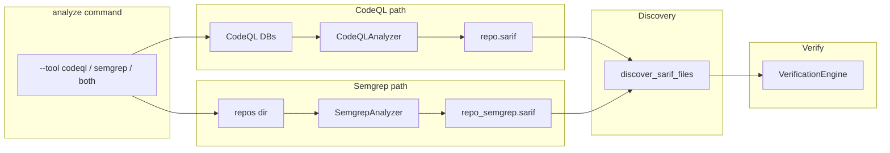

# Plan: Integrate Semgrep and Extensible Security Rules

**Overview:** Add Semgrep as a second analyzer that writes SARIF alongside CodeQL. Users can run CodeQL only, Semgrep only, or both via a `--tool` flag. Both paths feed the same verification stage with no change to verification logic. Optionally support adding more security rules for CodeQL (custom suites) and Semgrep (multiple configs).

---

## Current flow

- **Analyze:** [cmd_analyze](src/vuln_hunter_x/cli/commands.py) discovers CodeQL DBs via [discover_databases](src/vuln_hunter_x/codeql/context_extractor.py), runs [CodeQLAnalyzer.run_analysis](src/vuln_hunter_x/codeql/analysis.py), writes `output/<lang>/<repo_name>/<repo_name>.sarif`.
- **Verify:** [discover_sarif_files](src/vuln_hunter_x/sarif/parser.py) finds SARIF under `output/<lang>/<repo_name>/<repo_name>.sarif`, returns `(path, lang, repo_name)`; [parse_sarif_file](src/vuln_hunter_x/sarif/parser.py) and the verification engine consume findings. Context is resolved by `repo_name` (e.g. `repos/<lang>/<repo_name>/`).

**Note:** The codebase uses a single tree `output/<lang>/<repo_name>/` (no separate `output/sarif/`). CodeQL SARIF is at `output/<lang>/<repo_name>/<repo_name>.sarif`.

---

## Design choices

- **One analyze command, one output tree:** Keep a single `analyze` command and the existing `output/<lang>/<repo_name>/` tree. Add `--tool`: `codeql`, `semgrep`, or `both`.
- **Naming and layout:** CodeQL keeps `output/<lang>/<repo_name>/<repo_name>.sarif`. Semgrep writes to the **same repo directory**: `output/<lang>/<repo_name>/<repo_name>_semgrep.sarif` so both can coexist and discovery stays simple.
- **Repo name for verify:** For every SARIF file, `repo_name` must be the actual repo (e.g. `c-ares`) for context lookup. With the single-tree layout, discovery uses `repo_dir.name` as `repo_name` for all `*.sarif` in that dir (no stem stripping needed).
- **Verify:** No change to verification engine or to how it reads SARIF; only discovery and analyze behavior change.
- **Guided questions:** [QuestionsLoader.get_questions](src/vuln_hunter_x/questions/loader.py) already falls back to `_generate_generic_questions` for unknown rule IDs, so Semgrep rule IDs work without new mappings (optional: add Semgrep-specific entries to [guided_questions.yaml](config/prompts/guided_questions.yaml) later).

---

## 1. Semgrep analyzer module

**New:** `src/vuln_hunter_x/semgrep/` with `analyzer.py`.

- **SemgrepAnalyzer** (mirroring the CodeQL analyzer role):
  - `run_analysis(repo_path: Path, lang: str, repo_name: str, output_dir: Path, config: str | None = None) -> tuple[bool, Path | None, str]`.
  - Invoke CLI: `semgrep scan --sarif --sarif-output=<path> [--config=<config>] <repo_path>` (list argv, no shell; explicit timeout).
  - Map internal `lang` to Semgrep where needed (e.g. `c`/`cpp` → `c`/`cpp`; Semgrep uses `--config auto` for language detection or explicit `--lang`).
  - Write to `output_dir / lang / repo_name / f"{repo_name}_semgrep.sarif"`.
  - Require `semgrep` on PATH or `SEMGREP_PATH` env; return a clear error if missing.
- **Config:** Optional config for Semgrep (e.g. `auto`, `p/security-audit`, or path to YAML). Default `auto` if not specified. Support multiple configs (see section 4).
- **Skip/force:** Same pattern as CodeQL: skip if SARIF exists unless `--force`; optional `--dry-run`.

Reference: Semgrep CLI supports `semgrep scan --sarif --sarif-output=out.sarif <path>` and outputs SARIF 2.1 with `ruleId`, `message`, `locations` (physicalLocation with artifactLocation and region), so [SarifParser.parse_findings](src/vuln_hunter_x/sarif/parser.py) should work as-is.

---

## 2. SARIF discovery

**File:** [src/vuln_hunter_x/sarif/parser.py](src/vuln_hunter_x/sarif/parser.py).

Current behavior: iterate `output_dir/<lang>/` then for each `repo_dir` (subdir) look for exactly `repo_dir / f"{repo_name}.sarif"` with `repo_name = repo_dir.name`.

**Change:** For each `repo_dir` under `output_dir/<lang>/`, glob `repo_dir.glob("*.sarif")` and for each SARIF file append `(sarif_path, lang, repo_dir.name)`. This picks up both `<repo_name>.sarif` (CodeQL) and `<repo_name>_semgrep.sarif` (Semgrep) with the correct `repo_name` for verify and context.

---

## 3. Analyze command: --tool codeql | semgrep | both

**File:** [src/vuln_hunter_x/cli/main.py](src/vuln_hunter_x/cli/main.py).

- **_add_analyze_args:** Add `--tool` with choices `codeql`, `semgrep`, `both`; default `codeql` (backward compatible). Add `--semgrep-config` (default `auto`; allow multiple or comma-separated for extra rules). Add optional `--codeql-suite` to override the default query suite.
- **cmd_analyze** ([src/vuln_hunter_x/cli/commands.py](src/vuln_hunter_x/cli/commands.py)):
  - **codeql (current behavior):** Discover DBs via `discover_databases`, run CodeQLAnalyzer for each, write `output/<lang>/<name>/<name>.sarif`. Pass optional `suite` from `--codeql-suite` or config. Skip/force/dry-run as today.
  - **semgrep:** Load repo list from [config/repos.yaml](config/repos.yaml) via [load_repos_config](src/vuln_hunter_x/codeql/repository.py). For each repo with local path `repos/<lang>/<name>`, run SemgrepAnalyzer on that path; write to `output/<lang>/<name>/<name>_semgrep.sarif`. Filter by `--lang` and `--repo` like CodeQL. Semgrep does not require a CodeQL DB.
  - **both:** Run CodeQL branch first, then Semgrep branch, so both SARIF files exist per repo.
- Reuse existing `output_dir` (e.g. `base_path / "output"`). Pass `--force` and `--dry-run` into both analyzers.

---

## 4. Adding more security check rules

### 4.1 CodeQL

**Current:** [CodeQLAnalyzer.run_analysis](src/vuln_hunter_x/codeql/analysis.py) accepts optional `suite`; defaults to `DEFAULT_SUITES` (e.g. `codeql/cpp-queries:codeql-suites/cpp-security-extended.qls`). CLI does not expose it.

**Options:**

1. **CLI override (recommended):** Add `--codeql-suite <suite>`. `<suite>` can be a built-in reference (e.g. `codeql/cpp-queries:codeql-suites/cpp-security-extended.qls`) or a path to a **custom .qls file** that extends the default (e.g. includes security-extended plus extra queries/packs). Pass to `run_analysis(..., suite=...)` when `--tool codeql` or `--tool both`.
2. **Config:** In [config/confirm_findings.yaml](config/confirm_findings.yaml) add optional `codeql_suite: "path/to/custom.qls"`; CLI `--codeql-suite` overrides. Optionally per-repo in [config/repos.yaml](config/repos.yaml).
3. **Custom .qls:** Users create a `.qls` that references the standard security-extended suite and adds extra queries (local pack or `queries` directive). No VulnHunterX code change beyond passing the suite.

**Recommendation:** Implement (1) and optionally (2). Prefer one custom .qls over running multiple suites and merging SARIF.

### 4.2 Semgrep

**Planned:** One `--semgrep-config` (default `auto`). Semgrep supports **multiple** `--config` flags (registry IDs like `p/security-audit`, `p/owasp-top-ten`, or paths to YAML).

**Options:**

1. **Multiple configs via CLI:** Allow `--semgrep-config` to be specified multiple times and/or accept comma-separated list; pass each as `--config` to `semgrep scan` (e.g. `--semgrep-config auto --semgrep-config p/security-audit --semgrep-config rules/custom.yaml`).
2. **Config file:** In `confirm_findings.yaml` add e.g. `semgrep_configs: ["auto", "p/security-audit", "path/to/local.yaml"]`. CLI flags override or extend (document behavior). SemgrepAnalyzer builds the `--config` list from this.
3. **Custom YAML rules:** Users add rules under e.g. `config/semgrep/` and reference via `--semgrep-config config/semgrep/` or explicit files. Semgrep merges results into one SARIF.

**Recommendation:** Implement (1) and optionally (2). Use list argv and timeout for subprocess; avoid logging full command if it contains sensitive paths.

---

## 5. Verify command

No code changes. Verify already uses `discover_sarif_files` and `parse_sarif_file`. With the updated discovery, all `*.sarif` under `output/<lang>/<repo_name>/` (including `*_semgrep.sarif`) are picked up and `repo_name` is correct for context. Verification engine and LLM flow stay unchanged.

---

## 6. Optional config

In [config/confirm_findings.yaml](config/confirm_findings.yaml) (or a dedicated section), optional keys:

- `semgrep_config: "auto"` or `semgrep_configs: ["auto", "p/security-audit"]` so CLI can default Semgrep config from file.
- `codeql_suite: "path/to/custom.qls"` for default CodeQL suite.

CLI arguments override config. Low priority for first version; CLI defaults are enough initially.

---

## 7. Docs and CLI help

Update [README](README.md) (or CLI help) to document:

- `analyze --tool codeql`, `analyze --tool semgrep`, `analyze --tool both`.
- Verify reads all SARIF files under `output/<lang>/<repo_name>/` (CodeQL and Semgrep).
- Semgrep does not require a CodeQL database.
- How to add more rules: `--codeql-suite` and custom .qls; multiple `--semgrep-config` and custom YAML.

---

## Summary diagram

---

## File change list

- **New:** `src/vuln_hunter_x/semgrep/__init__.py` — export SemgrepAnalyzer.
- **New:** `src/vuln_hunter_x/semgrep/analyzer.py` — SemgrepAnalyzer, run_analysis, semgrep CLI invocation (list argv, timeout), output to `output/<lang>/<repo>/<repo>_semgrep.sarif`; support single or multiple configs.
- **Edit:** [src/vuln_hunter_x/sarif/parser.py](src/vuln_hunter_x/sarif/parser.py) — In discover_sarif_files, for each repo_dir under output_dir/<lang>/ glob `*.sarif` and append (path, lang, repo_dir.name).
- **Edit:** [src/vuln_hunter_x/cli/main.py](src/vuln_hunter_x/cli/main.py) — _add_analyze_args: add --tool, --semgrep-config (repeatable or comma-separated), --codeql-suite.
- **Edit:** [src/vuln_hunter_x/cli/commands.py](src/vuln_hunter_x/cli/commands.py) — cmd_analyze: branch on --tool (codeql / semgrep / both); for semgrep/both load repos from config and run SemgrepAnalyzer; pass --codeql-suite to CodeQLAnalyzer when codeql/both; optional config defaults for codeql_suite and semgrep_config(s).
- **Optional:** [config/confirm_findings.yaml](config/confirm_findings.yaml) — optional codeql_suite, semgrep_config or semgrep_configs.
- **Docs:** README (or CLI help) — Semgrep integration, --tool usage, and how to add more CodeQL and Semgrep rules.

No changes to verification engine, QuestionsLoader (generic fallback is sufficient for Semgrep rule IDs), or context extractor beyond correct repo_name from discovery.

---

## Detail build plan (implementation order)

Execute in the order below so each step has its dependencies in place. Each step is testable in isolation where noted.

### Phase 1: Semgrep module and SARIF discovery

**1.1 Create Semgrep package and analyzer**

- Create directory `src/vuln_hunter_x/semgrep/`.
- Add `src/vuln_hunter_x/semgrep/__init__.py`: import and re-export `SemgrepAnalyzer` from `analyzer`; expose in `__all__`.
- Add `src/vuln_hunter_x/semgrep/analyzer.py`:
  - **SemgrepAnalyzer** class with `__init__(self, semgrep_path: str = "semgrep", output_dir: Path | None = None, verbose: bool = False)`; resolve `semgrep_path` from `os.environ.get("SEMGREP_PATH", "semgrep")`.
  - Optional `set_logger(self, log_func)` for verbose output (same pattern as CodeQLAnalyzer).
  - **run_analysis(self, repo_path: Path, lang: str, repo_name: str, output_dir: Path, configs: list[str] | None = None) -> tuple[bool, Path | None, str]**:
    - If `configs` is None or empty, use `["auto"]`.
    - Build output path: `out_dir = output_dir / lang / repo_name`; `sarif_path = out_dir / f"{repo_name}_semgrep.sarif"`.
    - Create `out_dir` with `mkdir(parents=True, exist_ok=True)`.
    - Build argv: `[semgrep_path, "scan", "--sarif", f"--sarif-output={sarif_path}"]` then for each `c` in configs append `"--config", c` (two args per config so Semgrep gets multiple `--config`), then append `str(repo_path)`.
    - Run with `subprocess.run(argv, capture_output=True, text=True, timeout=3600)` (list argv, no shell). On success optionally count results in SARIF and return message; on failure return (False, None, stderr or stdout). Catch `subprocess.TimeoutExpired` and return clear error.
  - Before running: check that `semgrep_path` is executable (e.g. `shutil.which(semgrep_path)` or run `--version`); if not, return (False, None, "semgrep not found (set SEMGREP_PATH or install semgrep)").
- **Check:** From repo root, `python -c "from vuln_hunter_x.semgrep import SemgrepAnalyzer; print('ok')"` succeeds.

**1.2 Extend SARIF discovery**

- In `src/vuln_hunter_x/sarif/parser.py`, in **discover_sarif_files**:
  - Replace the inner loop that only checks `repo_dir / f"{repo_name}.sarif"` with: for each `repo_dir`, loop over `for sarif_file in sorted(repo_dir.glob("*.sarif")):` and append `(sarif_file, lang, repo_dir.name)` to `results`.
  - Update the docstring to state that all `*.sarif` under `output/<lang>/<repo_name>/` are discovered (CodeQL and Semgrep).
- **Check:** Existing behavior preserved for single `<repo_name>.sarif`; add a dummy `foo_semgrep.sarif` in a repo dir and confirm it is returned with the same `repo_name`.

### Phase 2: CLI and analyze command

**2.1 Add analyze arguments**

- In `src/vuln_hunter_x/cli/main.py`, in **_add_analyze_args** (after existing args):
  - `parser.add_argument("--tool", choices=["codeql", "semgrep", "both"], default="codeql", help="Analyzer(s) to run (default: codeql)")`
  - `parser.add_argument("--semgrep-config", action="append", dest="semgrep_configs", help="Semgrep config (repeatable); default: auto")` — then in commands, if `args.semgrep_configs` is None or empty, use `["auto"]`.
  - `parser.add_argument("--codeql-suite", help="CodeQL query suite (built-in ref or path to .qls)")`
  - Optional: `parser.add_argument("--config", type=Path, help="Path to repos.yaml (for Semgrep repo list)")` if you want to override config path for analyze; else use same as clone (e.g. `base_path / "config" / "repos.yaml"`).
- **Check:** `vuln-hunter-x analyze --help` shows `--tool`, `--semgrep-config`, `--codeql-suite`.

**2.2 Refactor cmd_analyze: CodeQL branch and suite**

- In `src/vuln_hunter_x/cli/commands.py`, in **cmd_analyze**:
  - Resolve `suite = getattr(args, "codeql_suite", None)` (optional: later load from config if None).
  - When calling `analyzer.run_analysis(db_path, lang, name)`, add `suite=suite` so CodeQL uses it when provided.
  - Keep existing behavior when `args.tool` is not yet used (default `codeql`): so current behavior remains for `--tool codeql` and when `--tool` is omitted (default).
- **Check:** `vuln-hunter-x analyze --repo <name> --dry-run` still works; with `--codeql-suite <path>` the suite is passed through (dry-run or one run).

**2.3 Add Semgrep branch in cmd_analyze**

- In **cmd_analyze**, after resolving `output_dir`, `base_path`, and args:
  - If `args.tool in ("semgrep", "both")`:
    - Resolve config path: `config_path = getattr(args, "config", None) or base_path / "config" / "repos.yaml"`.
    - Call `from vuln_hunter_x.codeql.repository import load_repos_config` and `repos = load_repos_config(config_path)`.
    - Build list of (lang, name) from repos: for each `r` in repos, `lang = (r.get("language") or "c").lower()`, `name = r.get("name")`; skip if no name; normalize lang to one of `c`, `cpp`, `python`, `javascript` (map as in existing codebase). Apply `--lang` and `--repo` filters to this list.
    - Resolve `repos_dir = base_path / "repos"` (or from config if you add it).
    - Instantiate `SemgrepAnalyzer(semgrep_path=os.environ.get("SEMGREP_PATH", "semgrep"), output_dir=output_dir, verbose=verbose)`; set logger if verbose.
    - For each (lang, name): `repo_path = repos_dir / lang / name`. If not `repo_path.is_dir()`, skip or warn. Semgrep SARIF path: `output_dir / lang / name / f"{name}_semgrep.sarif"`. If path exists and not force, skip (print SKIP). If dry_run, print would-run and continue. Else call `ok, result_path, msg = analyzer.run_analysis(repo_path, lang, name, output_dir, configs=args.semgrep_configs or ["auto"])`; print result.
  - If `args.tool == "both"`: run the CodeQL block first (discover DBs, run CodeQLAnalyzer for each), then run the Semgrep block as above. Share `--force`, `--dry-run`, `--lang`, `--repo` for both.
- **Check:** With a repo present in `repos/<lang>/<name>`, run `vuln-hunter-x analyze --tool semgrep --repo <name> --dry-run`; then run without dry-run and confirm `output/<lang>/<name>/<name>_semgrep.sarif` is created. Run `--tool both` and confirm both SARIF files exist.

**2.4 Wire --tool and avoid running CodeQL when tool is semgrep**

- At the start of **cmd_analyze**, branch on `args.tool`:
  - If `args.tool == "semgrep"`: do not call `discover_databases`; only run the Semgrep branch (load repos from config, run SemgrepAnalyzer). Exit after Semgrep loop.
  - If `args.tool == "codeql"`: run only CodeQL branch (current logic with suite passed). Exit after CodeQL loop.
  - If `args.tool == "both"`: run CodeQL branch, then Semgrep branch (same as above). No duplicate code: factor “run CodeQL for discovered DBs” and “run Semgrep for repos from config” into clear blocks.
- **Check:** `--tool codeql` does not run Semgrep; `--tool semgrep` does not require DBs; `--tool both` runs both.

### Phase 3: Extra rules and optional config

**3.1 Multiple Semgrep configs**

- Ensure **SemgrepAnalyzer.run_analysis** accepts `configs: list[str]` and passes each as `--config <c>` (two args per config). CLI already uses `args.semgrep_configs` (from `--semgrep-config` append). If user passes `--semgrep-config auto --semgrep-config p/security-audit`, both are used.
- Optional: support comma-separated in a single `--semgrep-config` (e.g. `--semgrep-config "auto,p/security-audit"`) by splitting on commas and extending the list.
- **Check:** Run with `--semgrep-config auto --semgrep-config p/security-audit` and confirm Semgrep receives both.

**3.2 CodeQL suite from config (optional)**

- In `cmd_analyze`, if `suite` is None and config is loaded (e.g. from `confirm_findings.yaml` or a shared loader), read optional `codeql_suite` from config and use as default. CLI `--codeql-suite` overrides.
- **Check:** With `codeql_suite` set in config and no `--codeql-suite`, that suite is used.

**3.3 Semgrep config default from config (optional)**

- If `args.semgrep_configs` is None/empty, try config file for `semgrep_config` (string) or `semgrep_configs` (list); use as default. CLI `--semgrep-config` overrides or extends (document which).
- **Check:** With `semgrep_configs: ["auto", "p/security-audit"]` in config and no CLI flag, both are used.

### Phase 4: Documentation and polish

**4.1 README**

- Add a short section (e.g. “Semgrep integration”) that explains: `analyze --tool codeql|semgrep|both`; that Semgrep runs on source and does not need a CodeQL DB; that verify reads all SARIF under `output/<lang>/<repo_name>/`. Document `--semgrep-config` (repeatable) and `--codeql-suite`. Add one or two one-liner examples.
- Add a subsection “Adding more security rules”: CodeQL custom .qls and `--codeql-suite`; Semgrep multiple `--semgrep-config` and custom YAML paths.

**4.2 env.example**

- Add `SEMGREP_PATH` (optional) with a one-line comment that it overrides the `semgrep` executable.

**4.3 check-env (optional)**

- In `src/vuln_hunter_x/cli/env.py`, add a check for Semgrep (e.g. run `semgrep --version` or which); report in check-env output so users know Semgrep is available when using `--tool semgrep` or `--tool both`.

### Sanity checklist (before considering done)

- [ ] `analyze --tool codeql` behaves as before (no regression).
- [ ] `analyze --tool semgrep --repo <name>` produces `output/<lang>/<name>/<name>_semgrep.sarif` and verify picks it up.
- [ ] `analyze --tool both` produces both SARIF files; `verify` sees findings from both.
- [ ] `discover_sarif_files` returns both `<repo>.sarif` and `<repo>_semgrep.sarif` with correct `repo_name`.
- [ ] Subprocess calls use list argv and timeout; no shell; no secrets in logs.
- [ ] README and help text document the new options and how to add more rules.
